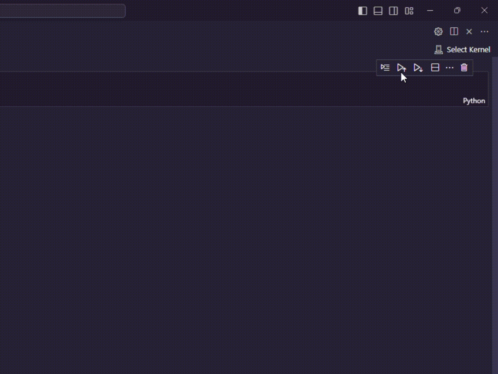

# Repositori Handson Mata Kuliah Multimedia (IF4021)

Repositori dibuat untuk mendokumentasikan hasil eksperimen pada Matakuliah Multimedia (IF4021).

## How to run?

> [!IMPORTANT]
> Sebelum dapat menjalankan proyek ini, pastikan Anda telah memiliki python (disarankan versi 3.12). Anda dapat mengunduh python [di sini](https://www.python.org/ftp/python/3.12.6/python-3.12.6-amd64.exe) atau melakukan pengunduhan melalui **_official store_** yang tersedia pada perangkat Anda.

1. Clone repositori ini

   ```bash
   git clone <url>
   ```

2. Masuk kedalam direktori
   ```bash
   cd if4021-handson
   ```
3. Inisialisasi lingkungan virtual environment
   ```bash
   python -m venv env
   ```
   atau
   ```bash
   python3 -m venv env
   ```
4. Aktivasi virtual environment
   - Windows
     ```bash
     env\Scripts\activate.bat
     ```
   - Other (Mac, Linux)
     ```bash
     source env\Scripts\activate.bat
     ```
5. Instalasi package
   ```bash
   pip install -r requirements.txt
   ```
6. Buka proyek pada Visual Studio Code (Disarankan)

   ```bash
   code .
   ```

7. Pilih kernel env

   

## Author

Bagus Ardin Saputra (120140176)
